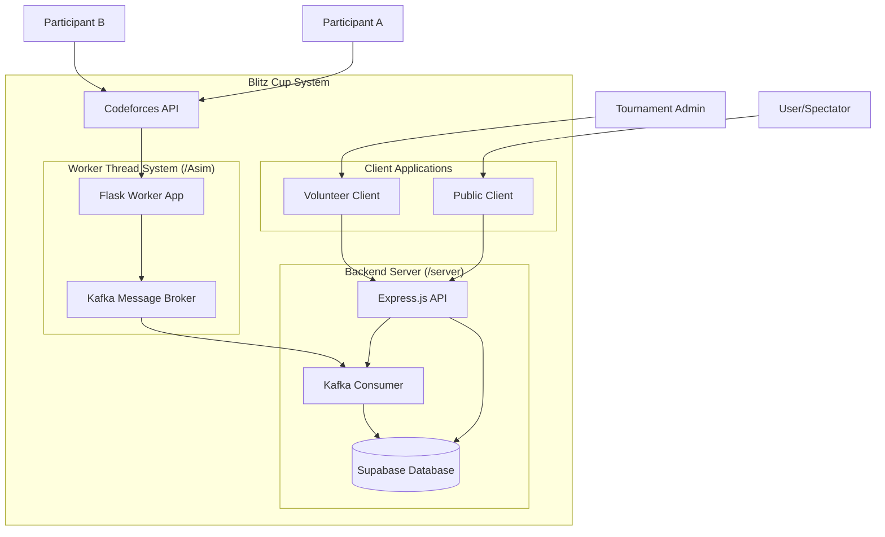
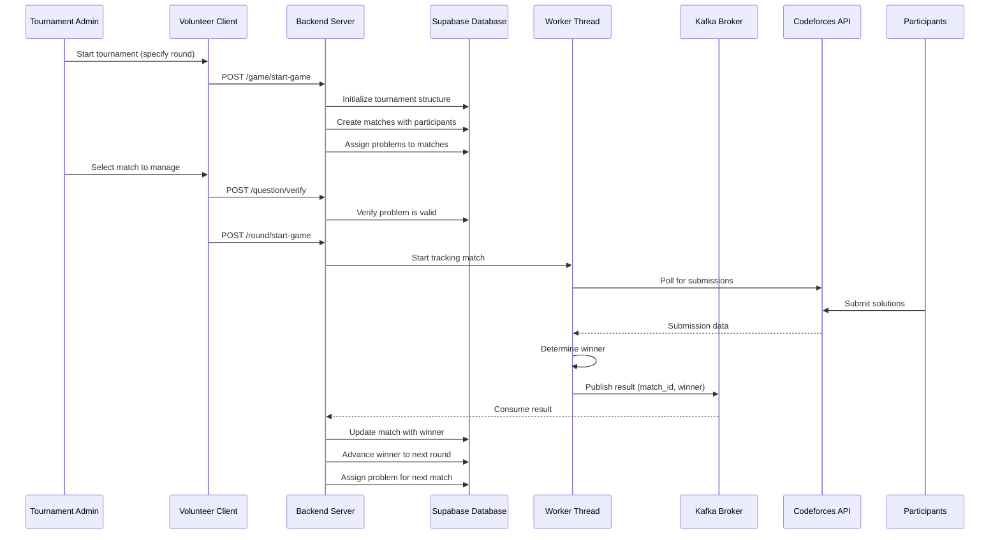
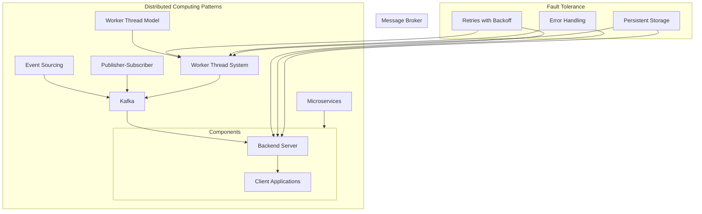
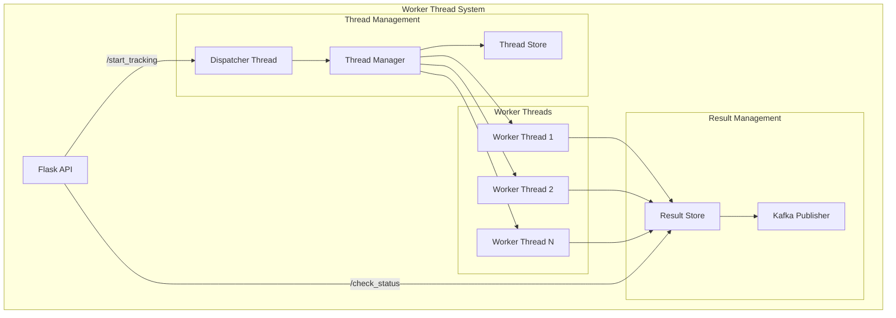
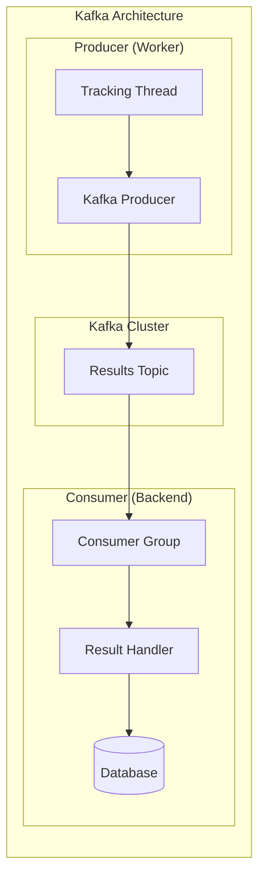

# Blitz Cup: 1v1 Competitive Coding Tournament System

Blitz Cup is a distributed computing platform designed to run 1v1 competitive coding tournaments with an automated progression system. Participants compete in a tournament bracket format (R32 → R16 → QF → SF → F) with real-time tracking of solutions.

## System Architecture

The project consists of four main components:

1. **Worker Thread System** (`/Asim`): Monitors Codeforces submissions and determines match winners
2. **Backend Server** (`/server`): Manages tournament structure, participants, and matches
3. **Public Client** (`/client`): Accessible to participants and spectators 
4. **Volunteer Client** (`/volunteer client`): Used by tournament admins/volunteers to manage matches

## Event Flow Architecture

The system uses an event-driven architecture with Kafka as the message broker to ensure reliable, decoupled communication between components.

## Distributed Computing Architecture

The system implements several distributed computing concepts to ensure scalability, fault tolerance, and responsiveness:

## Dispatcher Thread Model

The Worker Thread system implements a dispatcher model for efficient tracking of multiple matches simultaneously:

## Kafka Message Architecture

The system uses Kafka for reliable, asynchronous event processing:

## Technology Stack

- **Worker Thread System**: Flask, Kafka, Threading
- **Backend Server**: Express.js, Supabase, Kafka
- **Public Client**: React, Vite
- **Volunteer Client**: React, Vite, TailwindCSS
- **Database**: PostgreSQL (via Supabase)
- **Message Broker**: Kafka

## Conclusion

The Blitz Cup system demonstrates several key distributed computing concepts:

1. **Event-Driven Architecture**: Using Kafka for decoupled, asynchronous communication between components
2. **Thread Pooling**: Managing multiple concurrent matches with a thread dispatcher model
3. **Microservices Design**: Separating concerns into distinct services with well-defined interfaces
4. **Fault Tolerance**: Implementing retries, error handling, and persistent storage
5. **Real-Time Communication**: Enabling real-time updates for tournament progress
6. **Scalability**: Designed to handle multiple concurrent matches and participants

This architecture allows the Blitz Cup system to efficiently manage competitive coding tournaments while maintaining scalability, reliability, and responsiveness. 